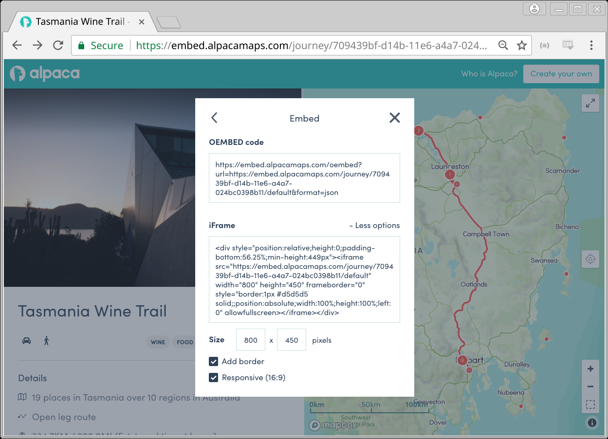

# "No Install" Options

The Alpaca platform is a hosted platform that can easily connect to your current
and future CMS or blog.

We've looked to develop the product from the ground up to be as friendly as
possible at working with content management systems, even the really old ones.

Without requiring plug-ins or special customisations, Alpaca can already be
used on most content management systems. We've had people use Alpaca easily on
platforms such as WordPress, Drupal, Squarespace, Sitecore, Hubspot, Medium
and even Sharepoint.

?> We also provide a [JavaScript Toolkit](quickstart) to provide enhanced
interactions to create further crafted experiences that integrate deeper with
your content.

## Easy Embed (IFrame)

The HTML 4.0 standard element IFrame has been the main method of embeding
content safely into websites since the mid 90's. For this reason, web
technologies have this built in.

This option is used by a lot of users to quickly integrate content within their
website or blog, and everything necessary can be obtain directly from viewing
the content.



?> **Note:** You can quickly obtain the IFrame code directly from any content
you find and embed on your website. Go to _sharing_ and then _embed_ in to
access simple IFrame codes.

## Widget Script Tag

Via a single widget script tag, you can include your asset in place. This will
use the oembed service discovery to embed your asset.

```html
<script
  data-id="journey/2181f781-95f5-11e8-a4a7-024bc0398b11"
  src="https://cdn.alpacamaps.com/scripts/alpaca-widget@v2.js"
></script>
```

| Script Element Attribute | Description                                |
| ------------------------ | ------------------------------------------ |
| data-view-mode           | The alternative view mode                  |
| data-container-id        | Specify the div container ID to embed into |

See the [Widget Script](widget) reference for more information.

## Embed.ly

Alpaca is listed on the popular embeding tool [embed.ly](https://embed.ly). A
number of popular online blogging tools (most prominantly Medium) already
support embed.ly and will work off the bat simply by pasting in the URL to the
Alpaca content in the editing window.


Embed.ly supports more than 500+ high-quality providers, of which Alpaca is
happy to be one.

[See Alpaca on embed.ly](https://embed.ly/provider/alpacamaps)

## oEmbed Standard

A lot of modern websites and CMS platforms support the
[oEmbed](https//oembed.com) Standard. If your web platform already supports this
standard, you will be able to simply supply the oEmbed URL to the platform.

The benefit of using oEmbed is that the CMS platform can communicate with the
Alpaca platform and request the information it needs to correctly embed the
content directly into your page.

Alpaca supports the full specification, providing both XML and JSON responses.

**_End point_**

```
https://embed.alpacamaps.com/oembed?url=<URL>&width=<WIDTH>&height=<HEIGHT>
```

| Parameter  | Description                                 |
| ---------- | ------------------------------------------- |
| url\*      | A URL that points to the alpaca map content |
| width      | The desired width of the iframe             |
| height     | The desired height of the iframe            |
| responsive | "false" to return a single iframe           |
| viewMode   | The desired view mode                       |
| baseUrl    | The base host url to use for assets         |

**_Example Response_**

```javascript
{
  "version": "1.0",
  "provider_name": "Alpaca Maps",
  "provider_url": "https://www.alpacamaps.com/",
  "type": "rich",
  "html": "<iframe...></iframe>",
  "width": 800,
  "height": 600
}
```

?> **_Note:_** On any piece of content, you can obtain the URL to use via
the map "share" and "embed" options.
